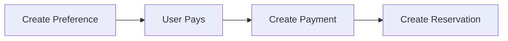

## Overview

The Payments API enables payment processing for reservations in the Zenda system. It handles payment creation and preference generation for payment providers like MercadoPago.

## Base Endpoint

```
/api/payments
```

## Available Endpoints

<CardGroup cols={2}>
  <Card title="Create Payment" icon="plus" href="/api/payments/create">
    Register a payment in the system
  </Card>
  <Card title="Create Preference" icon="file-invoice" href="/api/payments/create-preference">
    Generate a payment preference for providers
  </Card>
</CardGroup>

## Payment Object

Payments in the system follow this structure:

```typescript
interface Payment {
  id: string;
  reservation_id: string;
  amount: number;
  status: "PENDING" | "PAID" | "FAILED";
  payment_provider: string;
  external_payment_id?: string | null;
  created_at: string;
}
```

## Payment Flow

The typical payment workflow:

1. **Create Preference**: Generate a payment preference with reservation details
2. **Process Payment**: User completes payment with the payment provider (e.g., MercadoPago)
3. **Create Payment Record**: Register the payment in Zenda
4. **Create Reservation**: Create the reservation with payment attached



## Payment Status

Payments can have the following statuses:

- `PENDING` - Payment initiated but not completed
- `PAID` - Payment successfully processed
- `FAILED` - Payment failed or was rejected

## Payment Providers

Zenda currently supports:
- **MercadoPago** - Primary payment provider
- Additional providers can be integrated

## Authentication

All payment endpoints require Bearer token authentication.

## Key Concepts

### Payment Preference

A payment preference is a configuration object sent to the payment provider containing:
- Reservation details
- Amount to charge
- Success/failure callback URLs
- Customer information

### External Payment ID

When a payment is processed through a provider like MercadoPago, they assign an external ID. This ID is stored in the `external_payment_id` field to link our payment record with the provider's transaction.

## Related Features

### Professional Settings

Payment requirements are configured in [Professional Settings](/api/professional-settings/overview):
- `requires_deposit` - Whether payment is required
- `deposit_amount` - Amount to charge

### Reservations

Payments are closely tied to reservations:
- [Create With Payment](/api/reservations/create-with-payment) - Create reservation with payment
- [Create Without Payment](/api/reservations/create-without-payment) - Skip payment if not required

## Use Cases

- Process deposits for appointment bookings
- Generate payment links for clients
- Track payment status and history
- Integrate with payment providers
- Handle payment confirmations and failures

## Security Considerations

- All payment operations require authentication
- Payment amounts should be validated against professional settings
- External payment IDs should be verified with the provider
- Sensitive payment data is handled by the payment provider (PCI compliance)

## Next Steps

<CardGroup cols={2}>
  <Card title="Create Preference" icon="file-invoice" href="/api/payments/create-preference">
    Learn how to generate payment preferences
  </Card>
  <Card title="Create Payment" icon="plus" href="/api/payments/create">
    Learn how to register payments
  </Card>
</CardGroup>